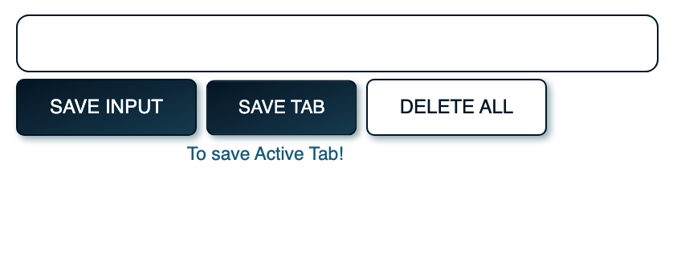
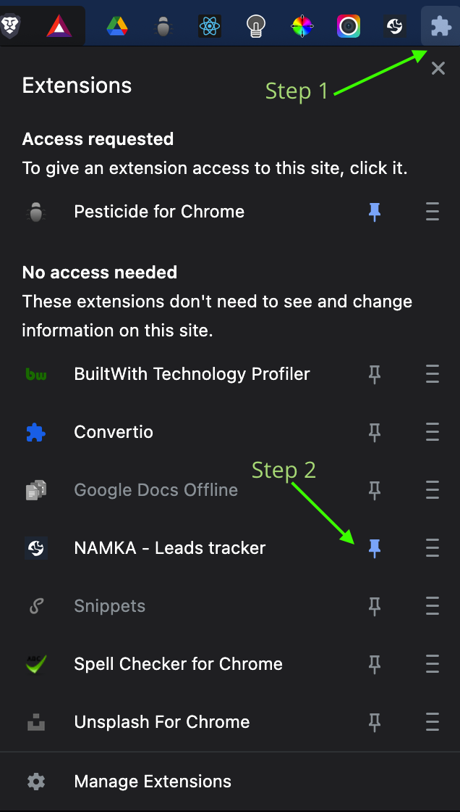
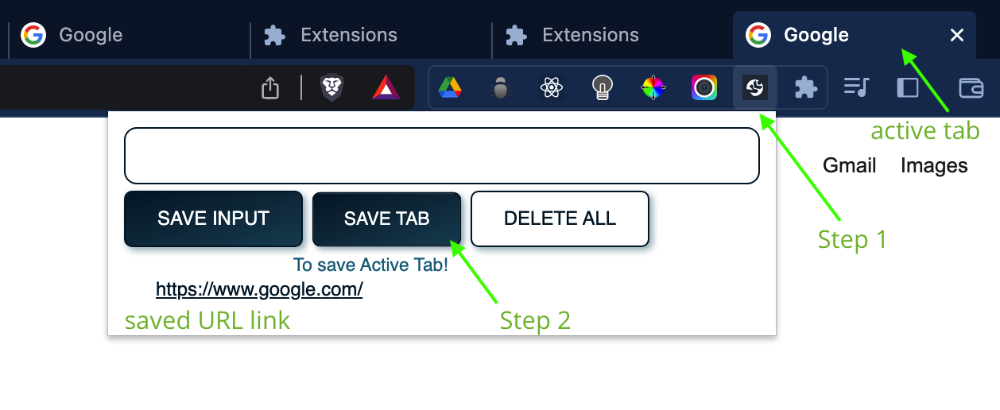

<!-- PROJECT LOGO -->
 

  

<h1 align="center">URL Tracker</h1>

  

    URL Tracker is a local web extention built using HTML, CSS, JavaScript. The aim of this extension is to conveniently save, insert and delete URLs.
     
    <a href="https://github.com/AliMora83/URL_Tracker/blob/main/URL_Tracker.zip">Download Extention</a>
    ·
    <a href="https://github.com/AliMora83/URL_Tracker/issues">Report Bug</a>
  

 
 

<!-- TABLE OF CONTENTS -->

  
Table of Contents

  <ol>
    <li>
      <a href="#getting-started">Getting Started</a>
      <ul>
        <li><a href="#installation">Installation Raodmap</a></li>
        <li><a href="#howto">How to use extension</a></li>
      </ul>
    </li>
    <li>
       <a href="#technologies">Technologies used</a>
    </li>
    <li><a href="#license">License</a></li>
    <li><a href="#contact">Contact</a></li>
  </ol>

 

<!-- GETTING STARTED -->
## Getting Started

To get a local copy up and running follow these simple example steps.

### [Download Extention](https://github.com/AliMora83/URL_Tracker/blob/main/URL_Tracker.zip)

(<a href="#readme-top">back to top</a>)

<!-- INSTALLATION -->
## Installation Roadmap

- [ ] Locate 'URL_Tracker.zip' on your computer.
- [ ] Unzip the folder.
- [ ] In Google Chrome, navigate to chrome://extensions.
Enable developer mode(similar option if required).
Drag and drop the extension file onto the extension management page to install it. Alternatively, use the "Load unpacked" or "Install" button.
- [ ] Ensure the extension is enabled if it's not already.

- [ ] Step 1: Open browser extensions.
- [ ] Step 2: **Locate URL Tracker** and **pin it**.

<!-- HOWTO -->
## How to use extension

- [ ] Step 1: Locate extention.
- [ ] Step 2: Press 'Save Tab' button.
- [ ] If you see the active tab URL, it works!
- [ ] Hover over any button for more info on it.

 
 

### **Save Input** button:
- Insert/Paste a URL in the provided input field.
- Press 'Save Input'.

### **Save Tab** button:
- Press to save **active tab** on **current window**.

### **Delete All** button:
- Double click to **delete all** saved URL links.

(<a href="#readme-top">back to top</a>)

 

<!-- TECHNOLOGIES -->
## Technologies used

  

  

(<a href="#readme-top">back to top</a>)

<!-- LICENSE -->
## License

Distributed under the MIT License. See `LICENSE.txt` for more information.

(<a href="#readme-top">back to top</a>)

<!-- CONTACT -->
## Contact

Ali Mora - [Website](https://alimora-portfolio.vercel.app/) - ali@openmindi.co.za

(<a href="#readme-top">back to top</a>)

 
 

This project started **July 1st, 2023**. 

Upgrades in progress.

